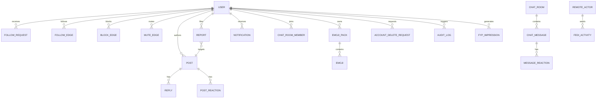
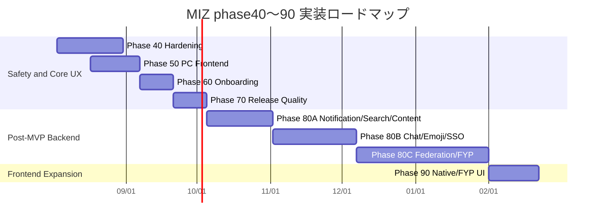

# MIZ.csv に基づく phase40〜90 実装計画

## エグゼクティブサマリー

MIZ.csv を確認したところ、phase40〜90 に該当する TODO は合計 52 件で、構成は phase40 が安全性・権限・削除、phase50 が PC/Web UI 基盤、phase60 がオンボーディング、phase70 がアクセシビリティと互換性、phase80 が通知・検索・メディア・チャット・カスタム絵文字・ActivityPub・FYP・SSO までを含む大型バックエンド拡張、phase90 がネイティブアプリ方針と FYP 表示、という形でした。特に phase80 は 1 つのフェーズとしては広すぎるため、そのまま実装すると進捗が見えにくく、品質リスクが高くなります。したがって、実行上は phase80 を複数のサブストリームに分割して管理するのが妥当です。（MIZ.csv 行3, 5, 7, 9, 11, 13, 17-22, 29-31, 42-50, 52, 57, 68-79, 81-84, 91, 93-101, 103, 105, 107-125, 129, 168, 170）

最優先は phase40 です。理由は、Block / Mute、Account Privacy、Moderation Administration、Post Report、30 日猶予の Account Delete / Restore が、通知・検索・チャット・FYP・連合の全てより先に「権限境界」と「被害抑止」の土台になるためです。これらが弱いまま後続機能を進めると、検索漏えい、通知漏えい、DM/チャット送信可否の矛盾、FYP での非公開投稿露出、ActivityPub 配送事故が起きやすくなります。（MIZ.csv 行3, 11, 13, 52, 81-84, 9, 69, 73, 108, 115, 125）

phase50〜70 は、もし MVP 完了済みコードに既に一部入っていても、**「実装済み扱い」にせず、仕様との差分確認フェーズ」として再整理するのが安全**です。CSV 上は phase50 が PC/スマホ UI の分離と SSR・状態設計、phase60 がアカウント作成オンボーディング、phase70 が WCAG 2.2 AA、字幕、代替テキスト、主要ブラウザ対応、3 秒以内の初回表示などのリリース品質要件を持っており、いずれも「見た目が動く」だけでは完了になりません。（MIZ.csv 行7, 17-22, 105, 129, 170）

Codex へ渡す順番は、**phase40 → phase50/60/70 の差分是正 → phase80 をサブストリーム化して順次投入 → phase90** が最も事故が少ないです。phase80 の中では、通知/検索/メディア/Markdown/Tree View のような比較的閉じた領域を先に固め、E2EE・ActivityPub・FYP のような高リスク/高複雑度領域は後ろに寄せるべきです。（MIZ.csv 行5, 9, 42-50, 57, 69, 108-123, 168）

## 調査範囲と前提

今回確認できた一次情報は **MIZ.csv のみ** で、実際のリポジトリコード、OpenAPI 定義、DB スキーマ、テストコードは提供されていません。そのため、この計画は **仕様ドリブンの実装計画** であり、実 Git 状態の「完了/未完了」を判定した監査結果ではありません。以下の「状態」は、CSV 上で TODO のままでありコード未確認であることを示す「未着手」または「Epic」として扱います。

技術スタック前提は CSV にかなり明示されており、フロントエンドは SvelteKit / Svelte / TypeScript、バックエンドは Rust / Axum / Tokio / SQLx、DB は PostgreSQL、配備は同一 Origin 配下で `/api/*` を Rust API へリバースプロキシする構成、SSE をリアルタイム更新、WebSocket は将来のチャットに利用、ジョブ処理は MVP 時点では PostgreSQL ジョブテーブルで開始、SvelteKit は `adapter-node` でコンテナ化する前提です。（MIZ.csv 行134-135, 168, 170, 172）

また、フロントエンドは「認証・認可・ビジネスロジックを重複実装しない」こと、プロフィールと投稿詳細は SSR、タイムラインと投稿 Composer は高応答のクライアント操作とすること、公開プロフィールと公開投稿は JavaScript 無効時も最低限読めることが要求されています。つまり、Codex に投げる実装計画も **server-as-source-of-truth** を崩さない設計に寄せる必要があります。（MIZ.csv 行170）

このため、以下の Codex 向けタスクでは、便宜的にリポジトリ構成を次のように仮定します。これは CSV のモジュラーモノリス前提から導いた**提案**であり、実リポジトリに合わせて置換してください。

```text
apps/api/
  src/
    routes/
    services/
    domain/
    repositories/
    auth/
    jobs/
  migrations/

apps/web/
  src/
    routes/
    lib/components/
    lib/stores/
    lib/api/
    lib/device/

packages/openapi/
  miz.openapi.yaml
```

行番号は、このレポートでは **CSV の 0 始まりのデータ行インデックス** として扱います。

## TODO とコメントから抽出した要求

phase40〜90 の TODO/コメントから見える要求は、単なる機能一覧ではなく、かなり強い制約を伴っています。要点を領域別に整理すると次の通りです。右端の `CSV行` が根拠です。

| 領域 | 抽出した主要要求と制約 | CSV行 |
|---|---|---:|
| 信頼・安全 | ブロック時は双方 Follow 解除、相手からの Follow / Reply / リアクション / 1対1チャット新規送信を禁止。ブロック相手は通常タイムライン・検索・通知・直接 URL でも非表示。ミュートは Following タイムライン抑制のみで、相手への通知なし。 | 3-4 |
| 権限・公開範囲 | アカウント公開/非公開、非公開 Follow 承認制、Reply は親投稿より公開範囲を広げない、未認可コンテンツの存在を 404 相当で秘匿、権限判定は全 API で共通ロジック化。 | 13-14 |
| モデレーション | Support / Moderator / Senior Moderator / Administrator / Auditor に権限分離。運営操作は追記専用監査ログへ記録、1 年保持、MFA 必須。 | 11-12 |
| 通報・削除 | 投稿/Reply 通報、30 日猶予削除、猶予中の復元、完全削除後はログイン不能。 | 52-53, 81-84 |
| PC / Web UI | PC 版 UI とスマホ版 UI を明確に分離、SSR、公開プロフィール/投稿は JS 無効でも最低限読める、PC/タブレットは PC UI、スマホはスマホ UI、既定境界は 768px で手動切替可。 | 105-106, 170-171 |
| 投稿 UI | 投稿カードの順序、 320px から崩れないこと、カード最大幅 680px、500 文字超を折りたたみ、縦長メディア初期高 600px 制限。 | 129-130 |
| オンボーディング | アイコン設定、Bio 設定、初投稿誘導はすべて任意。スキップ可能、アカウント単位で進捗保持、端末をまたいで再開可能。 | 17-22 |
| アクセシビリティ | WCAG 2.2 AA、キーボードのみ完了、画像 alt（500 文字以内）、動画字幕 WebVTT、主要ブラウザ最新 2 バージョン、iOS 16 / Android 10 以降、初回表示 3 秒以内。 | 7-8 |
| 通知 | アプリ内通知、重要アカウント変更のみメール通知、個別既読/一括既読、通知別オンオフ、同種リアクション通知集約、Push は MVP 対象外。 | 5-6 |
| 検索 | ユーザー・投稿・Reply・公開絵文字パック検索。返却時に権限再検証、更新は 30 秒以内に反映、1対1チャットは検索インデックスへ入れない。 | 9-10 |
| 投稿リッチ化 | 画像・音声・動画・長文・Markdown。画像は 4 枚まで、音声/動画は 1 つまで、メディア種別混在なし、位置情報削除、動画サムネイル生成、Markdown は CommonMark 安全サブセット。 | 42-51 |
| Reply | Tree / Nest View、最大 8 階層、古い順表示、削除親は墓石表示。 | 57-58 |
| チャット | 1対1は相互 Follow 条件、過去履歴は保持、メッセージ 1〜4000 文字、編集 15 分、削除時は tombstone。グループはサーバー側暗号化、1対1は E2EE。 | 69-75, 91-92 |
| リアクション | 投稿・チャットメッセージへのリアクション、同一絵文字トグル解除、1 人 1 対象につき最大 5 種類、Unicode と追加済みカスタム絵文字を利用。 | 76-80 |
| カスタム絵文字 | PNG/WEBP/GIF、1 個 1MB・128x128、1 パック 50 個、1 ユーザー所有 5 パック、`:emoji_name:` と内部 EmojiId を分離、同名自動選択なし、パック公開/非公開、ライブラリ追加は明示操作のみ。 | 93-101 |
| SSO | LINE は OAuth 2.0 Authorization Code + OIDC + PKCE S256、Discord は Authorization Code Grant。自動アカウント統合禁止、既存手段が無い連携解除禁止、トークンはサーバー側保護。 | 29-31 |
| ActivityPub | Actor / inbox / outbox / sharedInbox、WebFinger、Create/Update/Delete/Follow/Accept/Reject/Undo、配送の冪等化、署名/日時/Digest 検証、SSRF 防止、Public 以外は Relay 対象外。 | 107-110, 168-169 |
| FYP | 候補生成→安全フィルタ→説明可能スコア→多様性リランキング→フィードバック→評価。 p95 300ms、理由表示、A/B テストの安全停止、DM/E2EE/非公開投稿/センシティブ推定属性は学習対象外。 | 112-125 |
| ネイティブアプリ | 各 OS は対応する Web UI を共通利用し、OS 固有連携のみ薄いネイティブ層で実装。 | 103-104 |

以下の ER は、CSV に表れている依存関係を踏まえて、phase40〜90 を実装する際に最低限必要になるエンティティの整理図です。これは仕様要件から逆算した**提案モデル**です。



## フェーズ別実装計画

**Phase 40 は「安全に広げるための最後の土台」です。**  
ここでは Block / Mute、Account Privacy、Moderation Administration、Post Report、Account Delete / Restore をまとめて仕上げます。受け入れ条件は、アカウント単位の公開/非公開、非公開 Follow の承認、ブロック時の相互関係解除、権限のない直接 URL を 404 同等で扱うこと、監査ログと MFA、30 日猶予削除と復元です。以後の Search、Chat、ActivityPub、FYP はここで作る共通権限判定に依存させるべきです。（MIZ.csv 行3-4, 11-14, 52-53, 81-84）

```text
Codex brief: Phase 40 backend hardening

1. DB migration を追加する
   - account_visibility, follow_requests, user_blocks, user_mutes
   - moderation_roles, audit_logs, content_reports
   - account_delete_requests, purge_jobs
   - 必要な unique index / partial index / foreign key をつける

2. Rust domain service を実装する
   - RelationshipPolicy::can_view_profile()
   - RelationshipPolicy::can_view_post()
   - RelationshipPolicy::can_reply()
   - RelationshipPolicy::can_react()
   - RelationshipPolicy::can_dm()
   - Block/Mute/FollowRequest/DeleteRequest の state machine を作る

3. Axum route / handler を追加する
   - POST /api/users/:id/block
   - DELETE /api/users/:id/block
   - POST /api/users/:id/mute
   - DELETE /api/users/:id/mute
   - PUT /api/me/privacy
   - POST /api/users/:id/follow-requests
   - POST /api/reports/posts/:id
   - POST /api/me/delete-request
   - POST /api/me/delete-request/cancel
   - POST /api/me/delete-request/restore

4. 管理機能を追加する
   - role-based admin middleware
   - admin MFA check middleware
   - append-only audit logger
   - report review / action endpoints

5. 共通テストを追加する
   - public/private x follow-approved/pending x block x suspended matrix
   - direct URL authorization test
   - delete/restore/purge job integration test
   - audit log immutability test
```

このフェーズの完了条件は、公開範囲とブロック/ミュートが **全 API で一貫した結果**を返すこと、通報と削除操作が監査可能であること、30 日猶予削除のジョブが復元要求と競合しないことです。見積は実装純工数で約 156h、レビューと検証バッファ込みで 190〜220h を推奨します。理想ロールは Backend 1 名、Security/Infra 0.3 名、QA 0.3 名です。主なリスクは「API ごとに認可がずれること」なので、認可マトリクスを 1 箇所に寄せてテストも共有化します。（MIZ.csv 行3, 11, 13, 52, 81-84, 166, 172）

**Phase 50 は「PC/Web の実装を仕様どおりに整えるフェーズ」です。**  
CSV 上の要件は、PC 版 UI とスマホ版 UI の明確な分離、App Shell の分離、SSR、公開コンテンツの JS 無効時読解、デバイス判定と手動上書き、投稿カード設計です。つまり、単純なレスポンシブ CSS だけではなく、**情報設計ごと分ける**ことが必要です。（MIZ.csv 行105-106, 129-130, 170-171）

```text
Codex brief: Phase 50 frontend PC

1. UI variant 判定層を追加する
   - src/lib/device/variant.ts
   - server-side device hint + safe fallback
   - manual override cookie / local state
   - PC / smartphone / tablet の判定を分ける

2. App Shell を分離する
   - PC shell: left nav + content + right rail を想定
   - smartphone shell: bottom nav / compact header
   - shared domain logic は lib/api と store に閉じ込める

3. SSR ページを整備する
   - profile page SSR
   - post detail SSR
   - JS 無効でも公開プロフィール/公開投稿が読める HTML を返す

4. Post card component を実装する
   - アイコン→表示名/ハンドル→本文→添付の順
   - 500文字超は折りたたみ
   - 添付は width 100%、縦長は初期高 600px 制限
   - 320px でも崩れないことを保証する

5. Visual regression / layout test を追加する
   - 320px, 768px, 1024px, tablet landscape/portrait
```

完了条件は、PC とスマホで Shell が分かれつつ、API/権限判定は共通化され、プロフィール・投稿詳細が SSR で読めることです。見積は 70〜85h、理想ロールは Frontend 1 名 + Design 0.2 名です。依存は phase40 の権限 API と、既存 OpenAPI 契約の安定です。主要リスクは「UI variant ごとに API の扱いが分岐し、表示差異が機能差異になること」なので、shared store / API client を共通化し、Shell だけ分けます。（MIZ.csv 行105, 129, 170）

**Phase 60 は「スマホ向けフロントエンド全体」ではなく、CSV 上はオンボーディング完了フェーズです。**  
要件は、アイコン設定、Bio 設定、初投稿誘導の 3 ステップが個別にスキップ可能であり、完了状態をアカウント単位で保存し、端末をまたいで継続できることです。このため、単なる一度きりの UI ではなく、**サーバー保存される onboarding state** が必要です。（MIZ.csv 行17-22）

```text
Codex brief: Phase 60 onboarding

1. onboarding_progress テーブルを追加する
   - user_id, step_icon, step_bio, step_first_post, completed_at, skipped_at

2. API を追加する
   - GET /api/me/onboarding
   - POST /api/me/onboarding/skip
   - POST /api/me/onboarding/complete-step

3. UI を追加する
   - stepper component
   - icon setup CTA
   - bio setup CTA
   - first post CTA
   - skip と resume をサポート

4. 永続化と再開を実装する
   - 別端末でも状態が再開されること
   - 投稿完了時に first_post を自動完了すること
```

完了条件は、全ステップが任意であり、途中離脱後に最後の未完了項目から再開できることです。見積は 40〜45h、理想ロールは Frontend 1 名です。依存は phase50 の Shell/Router と phase20〜30 相当のプロフィール編集・投稿 API ですが、ユーザーの前提どおり MVP 実装済みならそこは利用するだけで済みます。（MIZ.csv 行18-22）

**Phase 70 は「リリース品質ゲート」です。**  
ここで求められているのは、WCAG 2.2 AA、キーボードのみで主要導線完了、alt text、WebVTT 字幕、最新 2 バージョンブラウザ、iOS 16 / Android 10 以降対応、初回 3 秒以内、失敗時の再試行と状態保持です。つまり、テストと QA が主役のフェーズです。（MIZ.csv 行7-8）

```text
Codex brief: Phase 70 release quality

1. a11y lint / test を追加する
   - axe based automated check
   - keyboard navigation smoke tests
   - focus return / modal trap tests
   - aria-live announcement tests

2. コンポーネントを修正する
   - visible focus ring
   - color-only state 廃止
   - reduced motion 対応
   - media autoplay 無効
   - tap target 最小サイズの調整

3. メディアアクセシビリティ
   - image alt text field
   - video caption upload (WebVTT)
   - player toggle for captions

4. 互換性と性能
   - browser matrix smoke tests
   - 320px layout tests
   - initial timeline interaction < 3s の計測
   - network failure retry preserving draft / scroll
```

完了条件は、「見た目で問題がない」ではなく、アクセシビリティと性能の**計測結果**がそろっていることです。見積は 50〜60h、理想ロールは Frontend 1 名 + QA/Accessibility 0.5 名です。主要リスクは、機能側が先に進みすぎてから A11y を後付けすることなので、このフェーズは Pull Request ごとの Definition of Done に織り込む前提で運用するべきです。（MIZ.csv 行7, 170, 172）

**Phase 80 は最も広く、実行上は四つのサブストリームに切り分けるべきです。**  
CSV のままだと Notification、Search、SSO、メディア投稿、Markdown、Reply Tree、Chat、Reaction、Custom Emoji、ActivityPub、FYP、Realtime Transport がすべて同一 phase に入っており、1 スプリントや 1 リリース列で扱うには大きすぎます。ここは次の順で分けるのが安全です。（MIZ.csv 行5, 9, 29-31, 42-50, 57, 68-79, 91, 93-101, 107-123, 168）

```text
Codex brief: Phase 80 stream split

Stream 80A: discoverability / rich content
- Notification
- Search
- long post / markdown
- image / audio / video post
- Reply Tree View
- post reaction

Stream 80B: communication
- mutual-follow gate for chat
- chat message
- group chat
- 1:1 E2EE
- chat reaction

Stream 80C: emoji / federation / transport
- emoji pack create/add/use
- emoji federation
- SSE hardening
- ActivityPub core federation
- relay management

Stream 80D: recommendation / identity
- FYP candidate generation
- filtering
- ranking
- diversity
- feedback / cold start
- evaluation / observability
- LINE SSO
- Discord SSO
```

80A の実装では、通知集約、不許可コンテンツの検索除外、DM 非索引、画像 EXIF 削除、動画処理中ステータス、Markdown の安全サニタイズ、Reply 8 階層制限を満たす必要があります。ここは比較的閉じた問題なので、最初に終わらせるとユーザー価値が高く、後続の Chat / FYP にも役立ちます。（MIZ.csv 行5-6, 9-10, 42-58, 77-78）

80B は高リスクです。1対1チャットは相互 Follow 条件、過去履歴保持、1〜4000 文字、添付制約、編集 15 分、削除 tombstone に加え、1対1本文と添付の E2EE、端末鍵の安全管理、新端末参加の既存端末承認という要件があります。ここは **まず平文チャット基盤を確定し、その後 E2EE を被せる**順でないと壊れやすいです。E2EE を先に始めないことを推奨します。（MIZ.csv 行69-75, 91-92）

80C はさらに危険域です。Custom Emoji は EmojiId 正本、`:name:` と内部表現の分離、同名自動選択禁止、パック公開/非公開、通報、更新反映、ActivityPub 相互運用まで含みます。ActivityPub は Actor 公開、共有 inbox、署名/Digest/日時検証、冪等配送、SSRF 防止、非公開配送禁止、Relay 管理まで要求しており、ここはセキュリティと運用監視が一体です。**feature flag 前提**で外部露出を制御しないと危険です。（MIZ.csv 行93-101, 107-110, 168-169）

80D の FYP は「ランキング API を作る」だけでは終わりません。候補 500 件以上、候補源配分、強制除外フィルタ、説明可能なルールベーススコア、多様性制約、コールドスタート、興味なし/ミュート/ブロック/通報などの負評価、オフラインリプレイ、A/B の自動停止、p95 300ms、ロールバック、バイアス監視まで入っています。これは事実上、**独立した推薦システム計画**です。Search や Timeline の延長ではなく、専用メトリクスと評価バッチを持つ前提で進めるべきです。（MIZ.csv 行112-123, 125）

```text
Codex brief: concrete Phase 80 code tasks

A. Notification / Search
- notifications, notification_preferences, notification_reads テーブルを作る
- notification fanout service と aggregate service を分ける
- search indexer を作るが、検索結果返却時に必ず permission re-check を行う
- chat content は search index に入れない
- 変更反映 SLA 30s を満たす reindex job を作る

B. Content / Media
- media_uploads テーブルと processing state を導入
- file sniffing, MIME validation, size validation, EXIF strip, thumbnail generation を追加
- CommonMark safe subset parser + sanitizer を導入
- reply_tree query と max_depth=8 enforcement を追加

C. Chat / Reaction
- chat_rooms, memberships, messages, message_edits, message_tombstones を作る
- mutual-follow gate middleware を追加
- まず non-E2EE chat を完成させ、その後 dm_e2ee_sessions / device_keys を追加
- reaction tables を post/message で分けるか polymorphic に統一する
- max 5 reaction kinds per actor per target をDBとserviceで enforce する

D. Emoji / Federation
- emoji_packs, emojis, user_emoji_library を作る
- shortcode resolution を server-side で実装し EmojiId を正本にする
- ActivityPub actor/object/activity モデルを追加
- HTTP signature / Digest / idempotency / SSRF guard を実装
- relay connection state machine を作る
- federation と relay は機能フラグ下で出荷する

E. FYP
- fyp_candidates materialization job
- eligibility filter service
- explainable scorer with versioning
- diversity reranker
- impression / action event log
- replay evaluator
- metrics + A/B kill switch
```

phase80 の完了条件は、サブストリームごとに Done を切ることです。全部同時完了を狙わないことが重要です。見積は実装純工数で約 828h、バッファ込みで 1,000〜1,160h を推奨します。理想ロールは Backend 2 名、Infra/SRE 0.4 名、Security 0.3 名、Frontend 0.5 名、FYP 期間は Ranking/ML 系 1 名追加です。主要リスクは、E2EE・ActivityPub・FYP を並列で始めてすべて詰まることです。したがって「80A 完了 → 80B 完了 → 80C/80D を並走」にするのが現実的です。（MIZ.csv 行5, 9, 29-31, 42-50, 57, 69-79, 91, 93-123, 168）

**Phase 90 は「共有 Web UI を活かした薄いクライアント化」と「FYP 表示」です。**  
CSV 上は、各 OS 向けネイティブアプリが対応する Web UI を共通利用し、OS 依存機能だけ薄いネイティブ層で持つこと、そして FYP のバックエンド完了後に PC/スマホ UI で理由表示付き FYP を出すことが要件です。したがって phase90 の本質は、**新規画面を大量に書くことではなく、shared UI のラッピング戦略**です。（MIZ.csv 行103-105, 125）

```text
Codex brief: Phase 90 frontend

1. thin native wrapper 方針を決める
   - Desktop: Tauri を第一候補
   - Mobile: Capacitor を第一候補
   - 画面と API client は apps/web を流用する

2. FYP presentation を追加する
   - ranking result + reason_code + ranking_version を表示
   - Following feed と明示切替
   - interest less / mute author / block / report actions へ導線を出す
   - client-side rerank を禁止する

3. impression tracking を厳格にする
   - IntersectionObserver 等で viewport 進入時のみ送信
   - preload と impression を分離
   - duplicate impression 防止

4. cross-platform QA
   - Windows / macOS / Android phone / iPhone / Android tablet / iPad
```

完了条件は、全 OS で同じ機能意味論を保ち、FYP の理由表示・否定フィードバック導線・Following/FYP 切替・アクセシブルな操作性が揃うことです。見積は 80〜90h、理想ロールは Frontend 1 名 + Mobile Wrapper 0.5 名です。依存は row125 が明示するとおり FYP バックエンド完了です。（MIZ.csv 行103-105, 125）

## 優先バックログと体制

まずフェーズ単位の要約です。工数は CSV TODO を粒度ごとに積み上げた**純実装工数**と、レビュー/QA/デバッグを加味した**推奨レンジ**を分けています。

| フェーズ | 主題 | 代表 CSV 行 | 純実装工数 | 推奨レンジ | 理想ロール |
|---|---|---|---:|---:|---|
| Phase 40 | 権限・安全・削除 | 3, 11, 13, 52, 81-84 | 156h | 190〜220h | Backend, Security, QA |
| Phase 50 | PC Web UI 基盤 | 105, 129, 170 | 60h | 70〜85h | Frontend, Design |
| Phase 60 | Onboarding | 17-22 | 32h | 40〜45h | Frontend |
| Phase 70 | A11y / 互換性 / 性能 | 7 | 40h | 50〜60h | Frontend, QA |
| Phase 80 | 通知〜FYP までの拡張 Backend | 5, 9, 29-31, 42-50, 57, 68-79, 91, 93-123, 168 | 828h | 1,000〜1,160h | Backend, Infra, Security, Ranking |
| Phase 90 | FYP UI / Thin Native Apps | 103, 125 | 64h | 80〜90h | Frontend, Mobile |
| 合計 |  |  | 1180h | 1416〜1652h |  |

以下が、CSV TODO をフェーズへマッピングした優先バックログです。`CSV行` が出典で、`Epic` は親タスク、`未着手` は CSV TODO のまま・コード未確認を意味します。

| 優先 | CSV行 | フェーズ | TODO | 状態 | オーナー | 見積 |
|---:|---:|---|---|---|---|---:|
| 1 | 3 | Phase 40 | Block / Mute | 未着手 | Backend | 24h |
| 2 | 11 | Phase 40 | Moderation Administration | 未着手 | Backend+Security | 40h |
| 3 | 13 | Phase 40 | Account Privacy | 未着手 | Backend | 32h |
| 4 | 52 | Phase 40 | Post > Post Report | 未着手 | Backend+Moderation | 16h |
| 5 | 81 | Phase 40 | Account Delete | Epic | Backend | 4h |
| 6 | 82 | Phase 40 | Account Delete > 期日(30日)内に、アカウントのデータを削除する | 未着手 | Backend | 24h |
| 7 | 84 | Phase 40 | Account Delete > 期日(30日)内ならアカウントを復元できるようにする | 未着手 | Backend | 16h |
| 8 | 105 | Phase 50 | UI Variants | 未着手 | Frontend+Design | 16h |
| 9 | 129 | Phase 50 | Postのデザイン | 未着手 | Frontend+Design | 20h |
| 10 | 170 | Phase 50 | System > Frontend / UI Variants | 未着手 | Frontend | 24h |
| 11 | 17 | Phase 60 | Onboarding | Epic | Frontend | 4h |
| 12 | 18 | Phase 60 | Onboarding > アイコン設定を誘導 | 未着手 | Frontend | 8h |
| 13 | 20 | Phase 60 | Onboarding > 説明文設定を誘導 | 未着手 | Frontend | 8h |
| 14 | 22 | Phase 60 | Onboarding > 投稿を誘導 | 未着手 | Frontend | 12h |
| 15 | 7 | Phase 70 | Accessibility / Compatibility | 未着手 | Frontend+QA | 40h |
| 16 | 5 | Phase 80 | Notification | 未着手 | Backend | 28h |
| 17 | 9 | Phase 80 | Search | 未着手 | Backend | 40h |
| 18 | 29 | Phase 80 | SSO > LINEアカウントでMIZアカウントを作成・ログインできるようにする | 未着手 | Backend+Security | 24h |
| 19 | 31 | Phase 80 | SSO > DiscordアカウントでMIZアカウントを作成・ログインできるようにする | 未着手 | Backend+Security | 24h |
| 20 | 42 | Phase 80 | Post > 画像投稿 | 未着手 | Backend | 24h |
| 21 | 44 | Phase 80 | Post > 音声投稿 | 未着手 | Backend | 20h |
| 22 | 46 | Phase 80 | Post > 動画投稿 | 未着手 | Backend | 28h |
| 23 | 48 | Phase 80 | Post > 長文投稿 | 未着手 | Backend | 8h |
| 24 | 50 | Phase 80 | Post > Markdown対応 | 未着手 | Backend | 12h |
| 25 | 57 | Phase 80 | Reply > Tree View | 未着手 | Backend | 20h |
| 26 | 68 | Phase 80 | Chat | Epic | Backend | 4h |
| 27 | 69 | Phase 80 | Chat > エンドツーエンド暗号化 | 未着手 | Backend+Security | 60h |
| 28 | 71 | Phase 80 | Chat > グループ作成 | 未着手 | Backend | 20h |
| 29 | 73 | Phase 80 | Chat > Chat Message | 未着手 | Backend | 40h |
| 30 | 76 | Phase 80 | Reaction | Epic | Backend | 4h |
| 31 | 77 | Phase 80 | Reaction > 投稿に対するリアクション | 未着手 | Backend | 12h |
| 32 | 79 | Phase 80 | Reaction > チャットメッセージに対するリアクション | 未着手 | Backend | 12h |
| 33 | 91 | Phase 80 | Follow > 相互フォローの場合は、チャットを送信できるようにする | 未着手 | Backend | 8h |
| 34 | 93 | Phase 80 | Custom Emoji Pack | Epic | Backend | 4h |
| 35 | 94 | Phase 80 | Emoji作成 | 未着手 | Backend | 24h |
| 36 | 95 | Phase 80 | Emoji作成 > 制限を設定する | 未着手 | Backend | 8h |
| 37 | 97 | Phase 80 | Emoji > Custom Emoji Packを追加できるようにする | 未着手 | Backend | 12h |
| 38 | 99 | Phase 80 | Emoji > 追加されたCustom Emoji Packをリアクションや本文で使えるようにする | 未着手 | Backend | 20h |
| 39 | 101 | Phase 80 | Emoji > Custom Emoji Federation | 未着手 | Backend | 40h |
| 40 | 107 | Phase 80 | ActivityPub Integration | Epic | Backend+Infra | 8h |
| 41 | 108 | Phase 80 | ActivityPub > Core Federation | 未着手 | Backend+Infra | 80h |
| 42 | 110 | Phase 80 | ActivityPub > Relay Management | 未着手 | Backend+Infra | 28h |
| 43 | 112 | Phase 80 | FYP Algorithm | Epic | Backend+Ranking | 8h |
| 44 | 113 | Phase 80 | FYP > Candidate Generation | 未着手 | Backend+Ranking | 40h |
| 45 | 115 | Phase 80 | FYP > Eligibility / Safety Filtering | 未着手 | Backend+Ranking | 24h |
| 46 | 117 | Phase 80 | FYP > Ranking / Scoring | 未着手 | Backend+Ranking | 40h |
| 47 | 119 | Phase 80 | FYP > Diversity Reranking | 未着手 | Backend+Ranking | 20h |
| 48 | 121 | Phase 80 | FYP > Feedback / Cold Start | 未着手 | Backend+Ranking | 32h |
| 49 | 123 | Phase 80 | FYP > Evaluation / Observability | 未着手 | Backend+Ranking | 24h |
| 50 | 168 | Phase 80 | System > Realtime / ActivityPub Transport | 未着手 | Backend+Infra | 28h |
| 51 | 103 | Phase 90 | Client Applications | 未着手 | Frontend+Mobile | 24h |
| 52 | 125 | Phase 90 | FYP > FYP Presentation | 未着手 | Frontend+Backend | 40h |

推奨体制は、前半の phase40〜70 を **Backend 1 / Frontend 1 / QA 0.5 / Security 0.3** で回し、phase80 以降で **Backend 2 / Frontend 1 / QA 0.5 / Infra 0.4 / Security 0.3 / Ranking 1** に拡張する形です。もし専任 2 名体制しか取れない場合、E2EE、ActivityPub、FYP は同時並行せず、必ずひとつずつ終わらせる運用に切り替えるべきです。これは他のどの TODO よりも phase80 の失敗率を下げます。（MIZ.csv 行69, 108-123, 168）

## スケジュールと Codex 投入フォーマット

以下は、2026 年 8 月 3 日開始の高レベル計画です。MVP 完了済みという前提を尊重しつつ、phase50〜70 を「完全新規開発」ではなく「仕様差分是正込みの安定化」として置いています。phase80 は実行上 3 本に分けています。



このスケジュールなら、最初の 8 週間で「安全に動く MVP 後基盤」を作り、そのあとに phase80 の大型機能へ入れます。特に FYP UI は row125 の注記どおり、バックエンド完了後にしか着手しない前提を守っています。（MIZ.csv 行125）

Codex にそのまま渡すための最小テンプレートは、フェーズごとに次の形にすると扱いやすいです。以下は汎用版で、`<PHASE>` と箇条書きを差し替えればそのまま使えます。

```text
あなたは MIZ リポジトリの実装担当です。
前提:
- バックエンドは Rust + Axum + SQLx + PostgreSQL
- フロントエンドは SvelteKit + TypeScript
- 認証・認可・ビジネスロジックはサーバー正本
- OpenAPI 契約を壊さずに前進させる
- migration は前方互換で書く
- すべての新規 API に unit/integration/authorization test を付ける

今回の対象:
<PHASE 名>

実装すること:
- <DB migration>
- <domain service>
- <route/handler>
- <frontend UI / SSR / store>
- <job / observability / feature flag>

完了条件:
- <受け入れ条件を具体化>
- format/lint/test/build/OpenAPI diff が通る
- rollback 手順を README または runbook に追記する

出力形式:
1. 変更計画
2. 追加・変更ファイル一覧
3. 実装
4. テスト
5. 残課題
```

最初に Codex へ投げるなら、以下の順が最も安全です。

```text
1. Phase 40: Account Privacy / Block-Mute / Moderation / Report / Delete-Restore
2. Phase 50: UI Variant shell + SSR + Post card
3. Phase 60: Onboarding persistence
4. Phase 70: Accessibility / Compatibility / Performance gate
5. Phase 80A: Notification + Search + Media + Markdown + Reply Tree + Post Reaction
6. Phase 80B: Chat Message + Mutual Follow Gate + Group Chat + E2EE + Chat Reaction
7. Phase 80C: Emoji + ActivityPub + Relay + Realtime transport
8. Phase 80D: FYP backend
9. Phase 90: Thin native wrappers + FYP Presentation
```

要するに、この CSV から見える最も重要な実装戦略は、**「phase40 で権限と削除を確立し、phase50〜70 で UI/品質を仕上げ、phase80 を一枚岩として扱わず、最後に phase90 で共有 UI を薄いクライアントへ展開する」** ことです。これが、CSV に書かれている安全・公開範囲・監査・アクセシビリティ・連合・推薦の要件を、最も少ない手戻りで満たす計画です。（MIZ.csv 行3, 7, 11, 13, 69, 108-125, 170, 172）